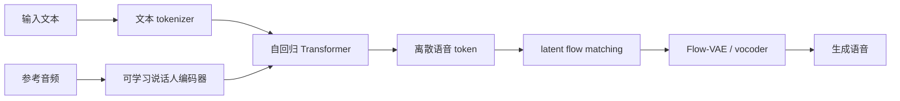

这篇文章读的是 MiniMax 团队在 2025 年 5 月发布的技术报告：[MiniMax-Speech: Intrinsic Zero-Shot Text-to-Speech with a Learnable Speaker Encoder](https://arxiv.org/abs/2505.07916)。它研究的是 TTS，也就是 Text-to-Speech：给模型一段文字，让模型把它说出来。

听起来很简单，但真正难的地方不在“发出声音”，而在“像人一样说话”。一个好的 TTS 系统至少要同时做好四件事：字要念对，声音要自然，情绪和停顿要合理，如果做声音克隆，还要尽量像参考说话人。MiniMax-Speech 这篇论文的核心贡献，是提出了一套更适合零样本声音克隆的 TTS 架构：只给一段参考音频，不需要知道这段音频说了什么，模型也能提取出说话人的音色，并用这个音色去朗读新的文本。

**这篇读完，你会知道：**

- 现代 TTS 为什么不只是“把字念出来”。
- MiniMax-Speech 怎么用一段参考音频抓住说话人的音色。
- zero-shot、one-shot、Flow-VAE、speaker encoder 这些词到底在系统里负责什么。

<nav class="article-toc" markdown="1">
**本文目录**

* 目录
{:toc}
</nav>

## 研究问题：TTS 到底难在哪里

如果只是把文字变成声音，早期系统也能做到。但现代 TTS 追求的是更接近真人的合成语音。这里有几个常见难点。

第一是发音准确。比如中文多音字、英文弱读、日语节奏、泰语和越南语声调，都会影响听感。论文里用 WER，也就是词错误率，衡量模型说出来的内容有没有被 ASR 正确识别。WER 越低，说明合成语音越清楚、越不容易念错。

第二是音色一致。做声音克隆时，用户通常会给一小段参考音频，希望模型用“这个人的声音”说新的内容。论文里用 SIM，也就是说话人相似度，衡量生成声音和参考声音有多像。

第三是自然度。人说话不是匀速读稿，会有重音、气口、停顿、情绪、语调变化。同一句话，如果用播音腔、疲惫口吻、激动口吻读出来，信息一样，感受完全不同。

第四是跨语言。一个人用中文录了一段参考音频，模型能不能用同一个音色说英文、日语、法语？这要求模型提取的是“这个人的声音特征”，而不是把参考音频里的文字内容也混进去。

MiniMax-Speech 主要就是围绕这些问题设计的。

## 整体思路：先抓住“这个人是谁”，再决定“说什么”

这篇论文的系统可以粗略理解成三层：

1. 文本侧：把输入文字切成模型能理解的 token。
2. 语音规划侧：用自回归 Transformer 生成离散的语音 token。
3. 声音还原侧：用 Flow-VAE 和 flow matching 把语音 token 变成更高质量的连续音频特征，再还原成波形。

其中最关键的是一个可学习的说话人编码器，也就是 learnable speaker encoder。它会从参考音频里提取音色、说话风格等信息，变成一个固定长度的条件向量。后面的生成模型就拿这个向量当“声音身份证”，再根据输入文字生成语音。

对小白来说，可以把它想成一次配音过程。文本告诉模型“台词是什么”，参考音频告诉模型“要像谁说”，Transformer 决定“这句话应该怎么念”，Flow-VAE 负责把前面的抽象计划打磨成真正能听的声音。

## 为什么说它是 intrinsic zero-shot

论文里特别强调一个概念：intrinsic zero-shot。这里需要先区分 zero-shot 和 one-shot。

很多声音克隆系统需要一段“音频 + 对应文字”的参考样本。比如给模型一段某人说“今天天气很好”的音频，同时告诉模型这段音频的文字就是“今天天气很好”。模型会把这对样本当成提示，再去生成新句子。论文认为这种方式严格来说更像 one-shot，因为它给了一个成对示例。

MiniMax-Speech 的 zero-shot 更干净：只给参考音频，不给转写文本，也不针对这个说话人做微调。模型要自己从音频里抽取“声音是谁”，然后把这个声音用在新文本上。

这个设计有几个好处。

一是使用门槛低。现实里拿到一段干净音频已经不容易，如果还要准确转写，流程会更麻烦。尤其是方言、混合语言、口语停顿很多的音频，转写错误还可能影响生成质量。

二是更容易跨语言。因为模型不依赖参考音频里的文字内容，所以它更有机会把音色和语义分开：音色来自参考音频，内容来自新文本。

三是表达空间更大。one-shot prompt 往往会把参考音频里的语速、情绪、停顿也一起带进来。zero-shot 只用说话人条件，反而可能让模型根据新文本自己安排更自然的语调和停顿。

## 可学习说话人编码器：不是拿现成声纹模型凑一下

说话人编码器并不是新概念。很多系统会先训练一个声纹识别模型，让它判断两段音频是不是同一个人，然后把这个模型拿来给 TTS 提供 speaker embedding。

MiniMax-Speech 的选择不一样：它把说话人编码器和 TTS 主模型一起训练。论文认为，声纹识别模型的目标是“分清谁是谁”，而 TTS 的目标是“合成像这个人的自然语音”。两者相关，但不是同一个任务。

举个例子，一个声纹模型可能很擅长区分 A 和 B，却不一定知道哪些音色细节对合成更重要。TTS 需要的不只是身份标签，还需要能指导发声的细节：音高范围、音色质感、说话风格、某些发音习惯。把说话人编码器放进 TTS 系统一起优化，等于让它直接服务于“生成好声音”这个目标。

论文的消融实验也支持这个判断。在中文数据子集上，作者比较了三种条件方式：可学习说话人编码器、预训练声纹 embedding，以及只用 one-shot prompt。结果显示，说话人编码器在 WER 和 SIM 上整体更稳。它不是单项指标永远最高，但在清晰度和相似度之间取得了更好的平衡。

## 自回归 Transformer：像语言模型一样生成语音 token

MiniMax-Speech 的主体是自回归 Transformer。自回归的意思是：模型不是一次性把整段语音全生成出来，而是像写文章一样，一个 token 接一个 token 地生成。

在大语言模型里，token 通常代表文字片段。在 TTS 里，token 可以代表被压缩后的语音单元。论文中，音频 tokenizer 使用 Encoder-VQ-Decoder 结构，在 mel-spectrogram 上做量化，语音 token 速率是每秒 25 个，并使用 CTC 监督来帮助保留语音细节和语义信息。

为什么要先变成 token？因为原始音频波形太密了。音频一秒可能有几万采样点，如果直接让 Transformer 预测波形，计算会非常重。把音频压缩成离散 token 后，模型更像是在学习一种“语音语言”：什么文字对应什么语音片段，什么音色条件下这些片段应该怎样排列。

这种方式的好处是表达能力强。自回归模型擅长处理上下文，能够根据前面已经生成的部分继续安排后面的语调、停顿和节奏。所以论文认为 AR 模型在韵律、语调和自然度上有优势。

## Flow-VAE：为什么还需要声音还原模块

如果只生成离散语音 token，声音还不够细腻。真正的音频有很多连续变化：气息、共振、尾音、混响、高频细节。MiniMax-Speech 在后半段使用 latent flow matching 和 Flow-VAE 来提升音质。

传统做法里，模型常常先预测 mel-spectrogram，再用 vocoder 把频谱图变成波形。mel-spectrogram 可以理解成声音的“热力图”：横轴是时间，纵轴是频率，颜色表示能量。它很有用，但也会形成信息瓶颈。声音里一些细微信息，可能在这个表示里被压掉。

MiniMax-Speech 的 Flow-VAE 选择建模从音频中学出来的连续 latent feature，而不是直接把 mel-spectrogram 当终点。VAE 负责学习一种压缩后的连续声音表示，flow 模型则让这个 latent 空间更好建模、更容易被生成模型预测。

白话一点说，VAE 像一个音频压缩器，把真实语音压成信息密度高的中间表示；flow 像一个整理工具，把这些中间表示整理到更规整、更容易学习的空间；最后 decoder / vocoder 再把它还原成波形。

论文认为，这样能提高音质上限，也能提升说话人相似度。技术报告页面里还展示了 Flow-VAE 与普通 VAE 的对比，指出 Flow-VAE 更少出现不自然的高频成分和电子音伪影。

## 实验怎么做：看清楚、像不像、自然不自然

论文的训练数据覆盖 32 种语言。数据处理上，作者强调了几个细节：用双 ASR 做转写校验，用 VAD 和 ASR 时间戳修正标点，用多说话人验证模型保证同一音频文件里音色一致。这些步骤听起来像工程细节，但对 TTS 很重要。语音数据一旦脏，模型很容易学到错误发音、错误停顿或混杂音色。

在声音克隆评测上，论文使用 Seed-TTS-eval，其中中文约 2000 条样本，英文约 1000 条样本。评估指标主要是 WER 和 SIM。WER 衡量可懂度，SIM 衡量声音相似度。

结果里有一个值得注意的现象：MiniMax-Speech zero-shot 在中文和英文上取得了很低的 WER，中文 0.83，英文 1.65；one-shot 的 SIM 更高，中文 0.799，英文 0.738。也就是说，zero-shot 更有利于发音清晰和自然表达，one-shot 在某些情况下更有利于贴近参考音色。

多语言评测中，论文把 MiniMax-Speech 和 ElevenLabs Multilingual v2 做了比较。结果显示，在中文、粤语、日语、泰语、越南语等语言上，MiniMax-Speech 的 WER 明显更低；SIM 则在测试的 24 种语言里都高于对比模型。论文把这个优势归因于文本无关的说话人编码器：它提取的是更接近“音色身份”的信息，所以跨语言时不容易被参考文本绑定住。

跨语言实验也很能说明问题。作者用中文说话人的参考音频，生成其他目标语言的语音。结果显示 zero-shot 在捷克语、罗马尼亚语、芬兰语、泰语、阿拉伯语、法语、越南语上都比 one-shot 有更低 WER。one-shot 的 SIM 通常更高，但跨语言发音准确性更差。这说明在跨语言场景里，参考 prompt 的文本和语音反而可能成为束缚。

## 扩展能力：情绪、文字造声音、专业声音克隆

MiniMax-Speech 的另一个重点是可扩展性。因为说话人编码器学到的是相对解耦的音色表示，系统可以在不修改主模型的情况下做一些扩展。

第一是情绪控制。论文使用 LoRA 做情绪模块，让模型可以按照指定情绪生成语音。LoRA 的好处是参数少，不需要大规模改动基础模型。论文里提到，为了让情绪和文本内容解耦，他们收集了同一文本下不同情绪的音频，让模型学习“同一句话可以有不同说法”。

第二是 Text to Voice，也就是用文字描述生成音色。传统声音克隆必须给参考音频，但 T2V 允许用户描述一个声音，例如“温暖的中年女声，语速略快，音调偏低”。系统会把自然语言描述和结构化标签，比如性别、语速、音高、音量，一起映射到音色表示空间。

第三是 Professional Voice Clone，简称 PVC。它适用于有更多目标说话人数据的场景。做法不是微调整个大模型，而是把某个说话人的条件 embedding 当成可学习参数，只优化这个小向量，主模型保持冻结。这样成本更低，也更容易为大量说话人部署定制声音。

## 这篇论文真正有意思的地方

我觉得这篇论文最有意思的点，不只是指标好，而是它对 TTS 的问题拆分更清楚。

过去很多声音克隆像是在问：“能不能给我一个例子，让我照着说？”MiniMax-Speech 更像是在问：“能不能先理解这个人的声音身份，再让这个声音自由地说新内容？”

这两个问题差别很大。照着说，容易把参考音频里的语速、停顿、情绪、甚至语言内容都带进来。理解声音身份，则更适合跨语言、长文本和多表达风格。它更接近一个可控语音生成系统，而不只是一个模仿器。

当然，这篇论文也有需要谨慎看的地方。

首先，论文报告的是技术系统和评测结果，但模型训练数据规模、清洗细节、工程实现、推理延迟、成本等信息并没有全部展开。如果想复现同等效果，公开论文还不够。

其次，WER 有时会出现“合成语音比 ground truth 更低”的情况，这不一定说明模型真的比真人更会说话，也可能和 ASR 评测偏好有关。合成语音往往更清楚、更规整，ASR 更容易识别；真人录音可能有口语化、吞音、噪声或自然停顿。

再次，声音克隆天然涉及安全和伦理问题。只需要一段参考音频就能克隆声音，意味着产品侧必须认真处理授权、标识、水印、滥用检测等问题。技术越强，边界越重要。

## 总结

MiniMax-Speech 可以看作一个面向大规模、多语言、可扩展声音生成的 TTS 系统。它的核心路线是：用可学习说话人编码器从未转写的参考音频里提取音色，用自回归 Transformer 生成离散语音 token，再用 Flow-VAE 和 latent flow matching 提升音频质量。

对小白来说，记住一句话就够了：MiniMax-Speech 不是简单地“模仿一段录音”，而是试图把“说话人的声音身份”和“要说的文字内容”拆开，再重新组合。这个拆分让它在零样本声音克隆、跨语言合成、情绪控制和专业声音定制上都有更大的空间。

如果说传统 TTS 是让机器把文字念出来，那么这类新系统已经开始接近另一件事：让机器学会用某一种声音，带着合适的语气，把一段话说给人听。

## 参考资料

- Bowen Zhang et al. [MiniMax-Speech: Intrinsic Zero-Shot Text-to-Speech with a Learnable Speaker Encoder](https://arxiv.org/abs/2505.07916), arXiv, 2025.
- MiniMax Team. [MiniMax-Speech Tech Report Demo Page](https://minimax-ai.github.io/tts_tech_report/), 2025.
