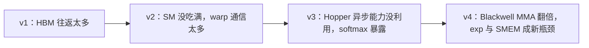

<figure class="technical-figure">
  
  <figcaption>四代 FlashAttention 做的是同一道数学题，变化的是怎样把这道题安排给 GPU。</figcaption>
</figure>

如果只用一句话解释 FlashAttention，我会说：**它没有少算注意力，而是少搬了大量中间结果。**

这句话看似简单，却改变了长上下文 Transformer 的工程现实。标准注意力常常不是“算不动”，而是被一个更朴素的问题拖慢：GPU 算得太快，数据来不及送到计算单元。FlashAttention v1 先解决最昂贵的显存往返；v2 重新安排线程块和 warp，让更多计算单元同时有活干；v3 针对 Hopper，把搬运、矩阵乘和 softmax 编成异步流水线；v4 到了 Blackwell，又发现 Tensor Core 变快以后，指数函数和片上内存反而成了新瓶颈。

这篇文章基于四篇原始论文来讲，不要求你会 CUDA。我们会从“注意力到底在算什么”开始，一步步走到 v4 的 TMEM、2-CTA 和软件指数函数。

<div class="article-brief" markdown="1">
**这篇读完，你应该能回答：**

- FlashAttention 为什么更快，却仍然是精确注意力？
- 显存占用从平方级降到线性级，究竟省掉了什么？
- online softmax 为什么只看一小块，也能得到完整 softmax？
- v2、v3、v4 为什么不是简单的“CUDA 代码优化版”？
- FlashAttention 是否降低了注意力的 $O(N^2)$ 计算复杂度？
- 训练、prefill 和单 token decode，谁更能从它受益？
</div>

<nav class="article-toc" markdown="1">
**本文目录**

* 目录
{:toc}
</nav>

## 先给结论：四代分别解决了什么

| 版本 | 主要目标 | 核心方法 | 主要硬件背景 |
|---|---|---|---|
| v1 | 不再把巨大注意力矩阵写回显存 | tiling、online softmax、重计算、kernel fusion | A100 等 GPU 的 HBM / SRAM 速度差 |
| v2 | 让 GPU 更饱和，减少线程之间的无效通信 | 沿序列并行、调整循环顺序、重分配 warp 工作、减少非矩阵乘操作 | Ampere A100，也可运行于后续架构 |
| v3 | 利用新硬件的异步能力和 FP8 | TMA、WGMMA、warp specialization、ping-pong、块量化、不相干处理 | Hopper H100 / H800 |
| v4 | 应对 Tensor Core 变快后出现的新瓶颈 | TMEM、更大 tile、软件 exp、条件重缩放、2-CTA、LPT 调度 | Blackwell B200 / GB200 |
{: .flash-version-table}

请先记住贯穿全文的两点：

1. **FlashAttention v1～v4 都没有把普通 dense attention 改成稀疏或低秩近似。**它们重新排列计算，但目标仍是同一个注意力结果；有限精度下会像其他高性能内核一样存在舍入顺序差异，v3 的 FP8 和 v4 的多项式 exp 还会引入受控的低精度误差。
2. **它们没有消灭 $O(N^2)$ 计算量。**前向传播仍需计算查询与键之间的成对关系。真正从平方级降下来的，是为中间注意力矩阵付出的额外显存空间。

## 第一层地基：注意力到底在算什么

假设一句话有 $N$ 个 token，每个注意力头的维度是 $d$。模型会为每个 token 产生三份向量：

- **Query，Q：**我正在找什么？
- **Key，K：**我有什么特征，别人为什么该关注我？
- **Value，V：**如果别人关注我，我实际贡献什么信息？

可以把它想成在图书馆找书。Query 是你的检索需求，Key 是每本书的标签，Value 是书里的内容。先拿 Query 和所有 Key 算相似度，再把相似度经过 softmax 变成权重，最后按权重混合 Value。

对一个注意力头，公式是：

$$
S = \frac{QK^\top}{\sqrt d}, \qquad
P = \operatorname{softmax}(S), \qquad
O = PV.
$$

这里：

- $Q,K,V$ 的形状通常是 $N\times d$；
- $S$ 是分数矩阵，形状为 $N\times N$；
- $P$ 是 softmax 后的概率矩阵，也是 $N\times N$；
- $O$ 是输出，回到 $N\times d$。

$S_{ij}$ 表示“第 $i$ 个 token 应该多关注第 $j$ 个 token”。所以序列越长，要比较的 token 对越多：$N$ 翻倍，$S$ 和 $P$ 的元素数量变成四倍。这就是注意力里那个著名的平方项。

### 一个显存数量级例子

当 $N=4096$ 时，一个注意力头的 $N\times N$ 矩阵有：

$$
4096^2 = 16{,}777{,}216
$$

个元素。只按 FP16 的 2 字节粗算，一个 $S$ 就约 32 MiB，一个 $P$ 又约 32 MiB。32 个头仅这两份中间矩阵就约 2 GiB；这还没乘 batch，也没算反向传播要保存的其他状态。

这个例子只是为了建立直觉。真实框架会有融合、重用、不同精度和不同生命周期，峰值显存不能直接用这条乘法精确预测。但它说明了为什么 $N\times N$ 中间量如此危险。

## 第二层地基：GPU 为什么会“算得快，跑得慢”

GPU 里不是只有一种内存。对本文最重要的是两层：

- **HBM / global memory：**容量大，通常几十 GB，所有流式多处理器都能访问，但离计算单元远。
- **片上存储：**包括 shared memory 和寄存器，容量小得多，却快得多，也更适合反复使用。

<figure class="technical-figure">
  
  <figcaption>论文中的 IO 不是硬盘读写，而主要是 GPU HBM 与片上存储之间的数据传输。</figcaption>
</figure>

把 GPU 想成厨房：HBM 是大仓库，shared memory 是厨师手边的小案板，Tensor Core 是切菜极快的机器。仓库能放很多东西，但每做一步都跑回仓库拿放一次，机器就会一直空等。

标准注意力通常拆成多个 GPU kernel：

1. 计算 $S=QK^\top$，把 $S$ 写到 HBM；
2. 从 HBM 读 $S$，做 mask 和 softmax，把 $P$ 写回 HBM；
3. 从 HBM 读 $P$ 与 $V$，计算 $O=PV$。

矩阵乘很适合 Tensor Core，速度极快；softmax、mask、dropout 等操作的算术强度较低，更容易受内存带宽限制。于是，大量时间不是花在“做乘法”，而是花在搬运 $S$ 和 $P$。

<figure class="technical-figure">
  
  <figcaption>FlashAttention 的目标不是让每个乘法更快，而是让 $S$、$P$ 小块在片上短暂存在，用完就丢。</figcaption>
</figure>

这也是“IO-aware”的含义：设计算法时，不只数 FLOPs，还要数数据在不同内存层级间移动了多少次。

## v1：第一次关键转折——不要生成完整的 S 和 P

2022 年的 [FlashAttention v1 论文](https://arxiv.org/abs/2205.14135) 提出一个听起来近乎反常识的做法：**计算完整注意力，但永远不在 HBM 中物化完整的 $S$ 和 $P$。**

它靠三个组合拳做到这一点：tiling、online softmax、重计算。

### 1. Tiling：大桌子摆不下，就分盘处理

GPU 片上空间放不下完整的 $Q,K,V$ 和 $N\times N$ 分数矩阵，但能放下小块。于是把：

- $Q$ 切成若干行块 $Q_i$；
- $K,V$ 切成若干列块 $K_j,V_j$；
- 每次只在片上计算 $S_{ij}=Q_iK_j^\top$。

这个 $S_{ij}$ 小块参与完 softmax 和 $V_j$ 的加权后就被丢弃，不写入 HBM。随后换下一个 $K_j,V_j$，继续更新同一块输出 $O_i$。

真正困难的是：softmax 的分母依赖一整行。你只看到一小块，怎么知道完整分母？答案就是 online softmax。

### 2. Online softmax：只带三个状态走完全程

普通 softmax 为避免指数溢出，会先减去整行最大值：

$$
\operatorname{softmax}(x_i)
=\frac{e^{x_i-m}}{\sum_k e^{x_k-m}},
\qquad m=\max_k x_k.
$$

问题是，第一块算完时，你还不知道后面会不会出现更大的数。online softmax 的办法不是猜，而是允许日后“改计价单位”。处理每一行时，保存三个状态：

- $m$：目前见过的最大值；
- $\ell$：以当前 $m$ 为基准的指数和；
- $O$：以当前尺度累积的加权 Value。

新分数块 $S_j$ 到来后：

$$
m_{new}=\max\left(m_{old},\operatorname{rowmax}(S_j)\right),
$$

$$
\ell_{new}=e^{m_{old}-m_{new}}\ell_{old}
+\operatorname{rowsum}\left(e^{S_j-m_{new}}\right),
$$

$$
O_{new}=e^{m_{old}-m_{new}}O_{old}
+e^{S_j-m_{new}}V_j.
$$

最后再做 $O/\ell$，就是完整 softmax 后乘 $V$ 的结果。

<figure class="technical-figure">
  
  <figcaption>online softmax 不是估计后半行，而是在新最大值出现时，把此前累计量精确换算到新尺度。</figcaption>
</figure>

来看一个只有四个数的小例子。先看到第一块 $[1,2]$：

$$
m_1=2,\qquad \ell_1=e^{1-2}+e^{2-2}=e^{-1}+1.
$$

再看到第二块 $[0,3]$，新最大值变成 3。旧的指数和原本以 2 为基准，现在要乘 $e^{2-3}$：

$$
\ell_2=e^{-1}(e^{-1}+1)+e^{-3}+1
=e^{-2}+e^{-1}+e^{-3}+1.
$$

右边恰好就是把完整向量 $[1,2,0,3]$ 全部减 3 后的指数和。没有猜测，也没有丢项，只是改变了计算顺序。

### 3. 反向传播：宁愿重算，也不要从 HBM 读大矩阵

训练时，反向传播通常需要 $S$ 和 $P$。标准做法会保存它们。v1 选择只保存输出 $O$ 和每行 softmax 的归一化统计量，在反向传播时把 $Q,K,V$ 小块重新载入片上，重新计算所需的 $S_{ij},P_{ij}$。

这会增加 FLOPs，听起来应该更慢；但论文的关键发现是：**重新做一些便宜且适合 Tensor Core 的计算，可能比把巨大中间量从 HBM 搬回来更快。**这是 selective recomputation，也可以看作非常有针对性的 gradient checkpointing。

### v1 的伪代码

下面省略 mask、dropout、批次和多头，只看一块 $Q_i$ 的核心逻辑：

```text
for each Q block Qi:
    load Qi to on-chip memory
    m = -infinity
    l = 0
    O = 0

    for each K/V block Kj, Vj:
        load Kj, Vj to on-chip memory
        S = Qi @ Kj.T
        m_new = max(m, rowmax(S))
        P_tilde = exp(S - m_new)
        l = exp(m - m_new) * l + rowsum(P_tilde)
        O = exp(m - m_new) * O + P_tilde @ Vj
        m = m_new

    write O / l to HBM
```

真实内核还要精心选择块大小、寄存器布局、共享内存布局、因果 mask 和线程分工。伪代码展示的是算法骨架，不是高性能 CUDA 实现。

### v1 到底把复杂度变成了什么

论文给出的结论是：

- 计算量仍是 $O(N^2d)$；
- 除输入输出外的额外显存从 $O(N^2)$ 降到 $O(N)$；
- 在论文模型下，标准注意力需要 $\Theta(Nd+N^2)$ 次 HBM 访问，而 FlashAttention 需要 $\Theta(N^2d^2/M)$，其中 $M$ 是片上 SRAM 容量。

这里不要死记式子。直觉是：片上空间越大，一次能处理的块越大，同一份输入被反复从 HBM 搬入的次数越少。v1 论文还证明，在一定 SRAM 大小范围内，不可能有一种精确注意力算法对所有 $M$ 都渐近优于这个 IO 数量级。

论文在 A100 上报告：注意力计算在 GPT-2 设置中最高可达 7.6 倍加速；端到端训练里，BERT-large 比当时的 MLPerf 1.1 记录快 15%，GPT-2 相对论文采用的 Hugging Face 基线约 3 倍。不同模型、序列长度、精度和基线差异很大，这些数字不能当作任何环境下的固定收益。

<div class="version-verdict" markdown="1">
**v1 一句话：**把“生成完整注意力矩阵再处理”改成“分块、在线归一化、当场消费”，用更多片上计算换取更少的 HBM 往返。
</div>

## v2：算法已经对了，但 GPU 还没吃饱

v1 解决了最大的 IO 问题，却没有逼近高性能 GEMM 的硬件利用率。2023 年的 [FlashAttention-2 论文](https://arxiv.org/abs/2307.08691) 指出，v1 通常只达到理论峰值的 25%～40%。问题不再主要是“大矩阵写回 HBM”，而是工作分配不够好。

v2 做了三件事。

### 1. 少做昂贵的非矩阵乘操作

A100 对 FP16/BF16 Tensor Core 矩阵乘的理论吞吐远高于普通 FP32 运算。v2 论文用当时 A100 的峰值说明：矩阵乘吞吐与非矩阵乘吞吐可相差约 16 倍。因此，即使 max、exp、乘法、缩放只占 FLOPs 的小部分，也可能吃掉不成比例的时间。

v2 调整 online softmax 更新方式：循环中维护未归一化的输出，只在最后除一次 $\ell$；反向传播只保存每行的 logsumexp：

$$
L=m+\log \ell,
$$

而不是同时保存 $m$ 与 $\ell$。数学目标不变，但减少了循环里的非矩阵乘操作和保存状态。

### 2. 沿序列长度增加线程块并行

v1 主要沿 batch 和 head 并行，一个注意力头由一个线程块处理。当 batch 很大、head 很多时没问题；可长序列训练经常被显存逼得 batch 很小，此时线程块数量可能不足以填满 A100 的所有 SM。

v2 把外层循环改成遍历 $Q$ 的行块，让不同 $Q_i$ 由不同线程块独立计算。即使只有一个长序列、少量 head，也能拆出足够多工作单元。

### 3. Warp 不再先分 K/V 再开会汇总

一个线程块内部通常包含多个 warp，每个 warp 是 32 个线程。v1 前向中，各 warp 分到不同的 $K,V$ 切片；算完后，它们需要把中间结果写入 shared memory、同步，再归约相加。这像四个人分别写了报告的不同段落，最后还要集中开会拼稿。

v2 改成把 $Q$ 的行分给不同 warp，而 $K,V$ 对所有 warp 可见。每个 warp 直接得到自己负责的输出行，不需要跨 warp 汇总中间结果，减少 shared memory 读写与同步。

<figure class="technical-figure">
  
  <figcaption>v2 的核心不是新的注意力公式，而是把任务切得更多、分得更独立。</figcaption>
</figure>

块大小也不是越大越好。大块能提高数据复用、减少 shared memory 操作，却会占更多寄存器与 shared memory；超过阈值会发生 register spilling，数据被迫溢到更慢的存储，甚至内核无法启动。v2 通常在有限的候选块形状中按 head dimension 调优。

论文在 A100 上报告，v2 相对 v1 约快 2 倍，前向最高达到理论峰值的 73%，注意力内核最高约 230 TFLOPs/s；用于 GPT 风格模型训练时最高达到每张 A100 225 TFLOPs/s，按论文采用的计算口径为 72% model FLOPs utilization。

<div class="version-verdict" markdown="1">
**v2 一句话：**v1 教会 GPU 少跑仓库，v2 则重新排班，让更多 SM 同时工作，并让 warp 少开同步会议。
</div>

## v3：Hopper 时代，关键是把等待藏起来

2024 年的 [FlashAttention-3 论文](https://arxiv.org/abs/2407.08608) 面向 NVIDIA Hopper，尤其是 H100。直接把 v2 搬到 H100，论文测到的利用率只有约 35%。因为 H100 不只是“更快的 A100”，它提供了新的异步硬件能力：

- **TMA（Tensor Memory Accelerator）：**专门负责 global memory 与 shared memory 之间的张量搬运；
- **WGMMA：**由一个 warpgroup 发起的异步 Tensor Core 矩阵乘，可直接从 shared memory 取操作数；
- **动态寄存器分配：**搬运数据的 warp 可以少占寄存器，把更多寄存器让给计算 warp。

v3 的核心词是 **asynchrony**。不是让某一步本身神奇地变快，而是在它等待时安排别的步骤。

### 1. Warp specialization：有人进货，有人做菜

v3 把同一 CTA 里的 warpgroup 分成生产者和消费者：

- 生产者用 TMA 提前把下一块 $K_j,V_j$ 搬进环形 shared-memory buffer；
- 消费者使用 WGMMA 计算 $Q_iK_j^\top$ 和 $P_{ij}V_j$；
- barrier 负责通知某个缓冲槽何时已装满、何时已消费。

由于 TMA 发出后不需要普通线程一直等着搬完，加载和计算能够重叠。只要流水线保持饱满，消费者做当前块时，生产者已经在准备下一块。

### 2. Ping-pong：一组做 softmax，另一组做 GEMM

H100 的矩阵乘极快，但 softmax 中的 max、exp、求和走别的硬件路径。论文给的 H100 SXM5 例子中，FP16 矩阵乘理论吞吐约 989 TFLOPs/s，而指数等特殊函数只有约 3.9 TFLOPs/s。虽然指数操作数量少得多，它依然足以形成可见气泡。

v3 安排两个消费者 warpgroup 交替工作：A 组做 softmax 时，B 组在 Tensor Core 上做矩阵乘；下一拍交换角色。这就是 ping-pong scheduling。它还把不同循环迭代交错：当前块做 softmax 时，下一块的 $QK^\top$ 已经异步启动。

<figure class="technical-figure">
  
  <figcaption>理想状态下，内存搬运、Tensor Core 矩阵乘和特殊函数单元都在同时忙。</figcaption>
</figure>

流水线并非越深越好。两阶段需要额外寄存器保存下一块分数；三阶段能重叠更多操作，却进一步增加寄存器压力。编译器还可能重排指令，破坏手工设计的顺序。v3 论文因此不仅给算法，还检查了生成的底层 SASS 指令是否真的形成重叠。

### 3. FP8：速度翻倍之前，先处理离群值

Hopper 的 FP8 Tensor Core 吞吐可达 FP16/BF16 的两倍，但 FP8 尾数位少，动态范围与精度都更难处理。大模型激活里常有少数幅值很大的离群值；如果整个张量只共享一个缩放因子，大多数普通值会被压缩到很差的精度。

v3 用两种办法降低误差：

**块量化（block quantization）**：不再让整个 $Q$、$K$ 或 $V$ 共用一个 scale，而是让每个计算块有自己的 scale。FlashAttention 本来就按块工作，所以这些 scale 可以自然地并入计算。

**不相干处理（incoherent processing）**：用随机正交矩阵 $M$ 同时变换 $Q$ 和 $K$，把离群值的能量摊到更多维度：

$$
(QM)(KM)^\top
=QMM^\top K^\top
=QK^\top,
$$

因为正交矩阵满足 $MM^\top=I$。在精确算术下，注意力分数不变；量化前的数值分布却更均匀，更不容易被少数离群值支配。

v3 还必须处理 FP8 WGMMA 的数据布局限制，例如在内核里转置 $V$ 的 tile，并通过寄存器字节置换把第一个矩阵乘的 FP32 累加器整理成第二个 FP8 矩阵乘需要的布局。这些细节说明，低精度提速绝不是简单把 dtype 改成 FP8。

论文在 H100 上报告：FP16 前向最高约 740 TFLOPs/s，即理论峰值的 75%，相对 v2 快约 1.5～2 倍；FP8 前向接近 1.2 PFLOPs/s。其 FP8 方案相对论文中的 per-tensor 量化基线，数值误差低约 2.6 倍。

<div class="version-verdict" markdown="1">
**v3 一句话：**让 TMA、Tensor Core 和 softmax 各走各的硬件通道，用异步流水线把彼此的等待时间藏起来，再让 FP8 快得更稳。
</div>

## v4：Tensor Core 太快以后，softmax 成了主角

2026 年 3 月的 [FlashAttention-4 论文](https://arxiv.org/abs/2603.05451) 面向 Blackwell B200 / GB200。它最有意思的观察不是“新 GPU 更快”，而是**硬件各部分变快的速度不一致**。

论文列出的 B200 对比中，BF16 Tensor Core 吞吐相对 H100 大约翻倍，达到每 SM 每时钟 8192 次运算；但指数单元仍是每 SM 每时钟 16 次操作，shared memory 读带宽也仍为每 SM 每时钟 128 字节。结果是：矩阵乘提前做完，开始等待 softmax 的 exp 和片上数据供应。论文的 roofline 分析显示，在典型注意力块上，非 MMA 资源可能比 MMA 计算多花 25%～60% 的周期。

<figure class="technical-figure">
  
  <figcaption>每一代优化都在追逐最慢的那一环；硬件升级会让旧瓶颈消失，也会暴露新瓶颈。</figcaption>
</figure>

### 1. TMEM 与更大的异步 MMA

Blackwell 增加了每个 SM 256 KB 的 Tensor Memory（TMEM），专门保存 Tensor Core 中间结果。Hopper 的 MMA 累加器主要写入寄存器；Blackwell 的 MMA 可以异步把结果直接写进 TMEM。

这有两个效果：

- 减轻寄存器压力，可以使用更大的 $128\times128$ MMA tile；
- softmax warpgroup、修正输出的 warpgroup 和驱动 TMA / MMA 的 warpgroup 可以围绕 TMEM 更独立地排流水线。

v4 仍采用类似 v3 的 ping-pong，但两个输出 tile 的分数、概率和累加器在 TMEM 中精心复用。论文甚至把输出重缩放拆给专门的 correction warpgroup，从 softmax 的关键路径上拿走。

### 2. 硬件 exp 不够，就用 FMA 软件算一部分

softmax 需要大量指数函数。B200 的 MUFU 指数单元吞吐没有跟 Tensor Core 一起翻倍。v4 于是让普通 FMA 单元用多项式近似分担一部分 $2^x$：

$$
2^x=2^{\lfloor x\rfloor}\cdot 2^{x-\lfloor x\rfloor}.
$$

整数部分可通过 IEEE 754 指数字段的位操作构造；$[0,1)$ 内的小数部分用低阶多项式和 Horner 法求值。这样 MUFU 和 FMA 能并行计算不同元素的指数。

全部改用软件 exp 会增加寄存器占用和延迟，所以 v4 只让大约 10%～25% 的元素走多项式，其余仍走硬件 MUFU，比例根据 tile 配置调优。

这一步确实是数值近似。论文在 400 万个随机输入上测试：三阶多项式的 FP32 最大相对误差约 $8.8\times10^{-5}$；但输出最终舍入到 BF16 后，BF16 自身约 $3.9\times10^{-3}$ 的量化误差占主导，三阶版本对 99% 输入与硬件结果相差不超过 1 个 BF16 ULP。换句话说，它利用了“最终本来就只保留 BF16 精度”这个事实。

### 3. 不必每出现一点新最大值都重缩放

online softmax 在新块出现更大最大值时，要把旧 $O$ 乘上 $e^{m_{old}-m_{new}}$。v4 观察到，最大值只增加一点时可以暂缓这次重缩放，继续以旧尺度累积；只在差值超过阈值 $\tau$ 时才整体换尺度。论文常用：

$$
\tau=\log_2 256=8.
$$

只要始终记录真实统计量，并在结尾按最终最大值和分母统一归一化，数学目标仍能恢复。工程上还要避免同一 warp 的线程走不同分支，因此只要 warp 中任意线程需要重缩放，整组就一起做。

### 4. 反向传播用 2-CTA 协作

反向传播要做五次矩阵乘，shared memory 流量比前向更重。Blackwell 支持两个 CTA 合作执行一次 MMA：两个 CTA 各自只暂存一半操作数 $B$，硬件把它们视作一个更大的 $M=256$ tile。

v4 还用 distributed shared memory 在 CTA 对之间交换一半 $dS$，重排 $dQ$ 的归约。论文的周期模型中，典型块的 shared-memory 时间从单 CTA 的 3328 周期降到双 CTA 的 2688 周期，和 2560 周期的 MMA 计算更接近；$dQ$ 的全局原子加数量也减半。

v4 额外提供确定性反向传播：通过信号量按固定顺序执行跨 CTA 归约，方便可复现训练和调试。因果 mask 与变长序列天然负载不均，v4 还用 longest-processing-time-first（LPT）思路优先调度较重的工作块，同时考虑 L2 缓存复用。

### 5. 为什么 v4 用 Python 写也是论文贡献

v4 完全用嵌在 Python 中的 CuTe-DSL 实现，再降到 PTX 与 SASS，不包含 CUDA C++ 主体。重点不是“Python 解释器跑 GPU 内核”，而是用 Python 做元编程，最终仍生成底层 GPU 指令。

论文报告单个 kernel 编译时间从 v3 C++ 模板的前向 55 秒、反向 45 秒，降到 v4 的 2.5 秒和 1.4 秒，约快 20～30 倍。更快的 JIT 让开发者能更容易组合 mask、block sparse、变长序列和调度策略。

论文在 B200、BF16 下报告：v4 最高达到 1613 TFLOPs/s，约为理论峰值的 71%；相对 cuDNN 9.13 最高快 1.3 倍，相对论文测试的 Triton 实现最高快 2.7 倍。论文也注明，较新的 cuDNN 后来吸收了其中多项技术，性能已更接近 v4。

<div class="version-verdict" markdown="1">
**v4 一句话：**当矩阵乘已经快到不是唯一主角，v4 开始优化指数函数、TMEM 流水线、shared-memory 流量和跨 CTA 归约。
</div>

## 把四代连起来：它们其实在追逐同一个移动靶

四代演进可以概括成一条性能工程规律：**瓶颈会移动。**



v1 不是最后答案，因为减少 HBM 流量后，线程调度问题变明显；v2 提高并行效率后，Hopper 的异步硬件没有被充分利用；v3 把矩阵乘和 softmax 重叠后，Blackwell 又把矩阵乘吞吐翻倍，指数单元和 shared memory 便站到了聚光灯下。

所以 FlashAttention 不是某个固定的小技巧，而是一套方法论：

1. 先分析硬件层级和真实瓶颈；
2. 改变计算顺序，让中间量留在更快的存储；
3. 把不同硬件单元能做的工作重叠；
4. 在有限精度允许的范围内减少不必要操作；
5. 换一代硬件后重新做分析，而不是默认旧 kernel 自动变快。

## 最容易误解的六件事

### 误解一：FlashAttention 把 $O(N^2)$ 变成了 $O(N)$

不对。对普通 dense self-attention，成对分数的计算仍是 $O(N^2d)$。线性的是额外显存空间，而不是总计算量。

如果要改变计算复杂度，需要稀疏注意力、滑动窗口、低秩/核近似等算法改变。它们可以和 FlashAttention 的 IO-aware 实现思想组合，但不是同一件事。

### 误解二：FlashAttention 会损失模型效果

v1、v2 的核心算法是精确 attention 的重排，不是近似 attention。由于浮点加法不满足结合律，分块和重排会产生末位数值差异，就像两个不同 GEMM 内核也可能不逐 bit 相同。v3 FP8 和 v4 多项式 exp 则明确使用低精度技术，需要按论文给出的误差与任务需求评估。

### 误解三：省掉的是 KV cache

不是。FlashAttention 主要省掉 $S,P$ 这类注意力中间量。自回归推理的 KV cache 保存历史 token 的 $K,V$，其容量随上下文长度线性增长，FlashAttention 不会让它消失。MQA、GQA、KV 量化、分页 KV cache 等技术处理的是另一层问题。

### 误解四：长上下文一定按同一倍数提速

收益受序列长度、batch、head dimension、因果 mask、数据类型、GPU 架构、前向/反向、框架调度和基线质量影响。论文里的“最高”性能是在特定配置下测得，不能跨代直接比较：A100 的 TFLOPs、H100 的 TFLOPs 与 B200 的 TFLOPs不是同一条跑道。

### 误解五：任何 GPU 都该装最新 v4

不对。v3 的关键硬件是 Hopper 的 TMA / WGMMA；v4 论文核心面向 Blackwell 的 TMEM 和 2-CTA。算法思想可以迁移，具体 kernel 却高度依赖架构。消费级 GPU、AMD GPU 和不同 CUDA 版本可能走完全不同实现。

### 误解六：FlashAttention 对 decode 和训练一样有效

训练和 prefill 中，Query 长度通常较大，有大量 $QK^\top$ 与 $PV$ 计算，分块融合非常重要。单 token decode 时，Query 长度往往是 1，主要工作变成从 KV cache 读取长历史，常常更受 KV 读取带宽和并行度限制。Flash-Decoding、paged attention、MQA/GQA 等技术会更直接影响这一阶段。现代库可能在同一个“attention backend”名称下自动组合多种路径，不应把所有推理加速都归因于最初的 v1 算法。

## 在 PyTorch 里怎样确认自己真的用了 FlashAttention

多数用户不需要手写 CUDA。PyTorch 的 `scaled_dot_product_attention` 会根据设备、dtype、张量形状与 mask 自动选择可用后端：

```python
import torch
import torch.nn.functional as F

q = torch.randn(2, 16, 2048, 128, device="cuda", dtype=torch.bfloat16)
k = torch.randn(2, 16, 2048, 128, device="cuda", dtype=torch.bfloat16)
v = torch.randn(2, 16, 2048, 128, device="cuda", dtype=torch.bfloat16)

out = F.scaled_dot_product_attention(q, k, v, is_causal=True)
```

如果想在测试中强制 FlashAttention 后端，可以用上下文管理器：

```python
from torch.nn.attention import SDPBackend, sdpa_kernel

with sdpa_kernel(backends=[SDPBackend.FLASH_ATTENTION]):
    out = F.scaled_dot_product_attention(q, k, v, is_causal=True)
```

如果输入不满足 fused kernel 条件，PyTorch 会给出无法使用的原因。排查时重点看：

- GPU 架构是否支持对应后端；
- dtype 是否为 FP16 / BF16 等支持类型；
- head dimension、stride 与张量布局是否满足限制；
- mask、dropout、GQA、变长序列等功能是否被当前版本支持；
- 当前 PyTorch、CUDA 和驱动组合是否匹配。

这些限制会随版本变化，使用时应以 [PyTorch SDPA 当前文档](https://docs.pytorch.org/docs/stable/generated/torch.nn.functional.scaled_dot_product_attention) 和 [FlashAttention 官方仓库](https://github.com/Dao-AILab/flash-attention) 为准。官方仓库当前把 v3 beta 路径定位于 H100 / H800，并提供基于 CuTe-DSL、面向 Hopper 与 Blackwell 的 v4 包；生产环境不要只看包名，还要核对实际选中的 kernel、硬件架构与功能覆盖。

## 如果只记住一个心智模型

标准注意力像这样：

> 算一大步 → 把巨大中间结果送回仓库 → 再取回来 → 算下一步。

FlashAttention 像这样：

> 从仓库拿一小批原料到案板 → 在案板上连续完成打分、归一化和加权 → 只把最终结果送回仓库。

v2 在此基础上重新排班，让所有厨师都忙起来；v3 增加传菜员和异步流水线，让备料与烹饪同时发生；v4 发现灶台已经快得惊人，于是开始优化调料研磨、案板流量和两组厨师协作。

这就是 FlashAttention 最值得学习的部分：它提醒我们，算法的成本不只在“算了多少”，还在“数据去过哪里、等了多久、哪些硬件单元正在闲着”。一个数学上 FLOPs 更多的方案，完全可能因为更懂硬件而跑得更快。

## 参考论文与官方资料

- Ashish Vaswani et al. [Attention Is All You Need](https://arxiv.org/abs/1706.03762), NeurIPS 2017.
- Maxim Milakov, Natalia Gimelshein. [Online normalizer calculation for softmax](https://arxiv.org/abs/1805.02867), 2018.
- Tri Dao et al. [FlashAttention: Fast and Memory-Efficient Exact Attention with IO-Awareness](https://arxiv.org/abs/2205.14135), NeurIPS 2022.
- Tri Dao. [FlashAttention-2: Faster Attention with Better Parallelism and Work Partitioning](https://arxiv.org/abs/2307.08691), 2023.
- Jay Shah et al. [FlashAttention-3: Fast and Accurate Attention with Asynchrony and Low-precision](https://arxiv.org/abs/2407.08608), NeurIPS 2024.
- Ted Zadouri et al. [FlashAttention-4: Algorithm and Kernel Pipelining Co-Design for Asymmetric Hardware Scaling](https://arxiv.org/abs/2603.05451), 2026.
- Dao-AILab. [FlashAttention 官方实现仓库](https://github.com/Dao-AILab/flash-attention).
- PyTorch. [Scaled Dot Product Attention 官方文档](https://docs.pytorch.org/docs/stable/generated/torch.nn.functional.scaled_dot_product_attention).
